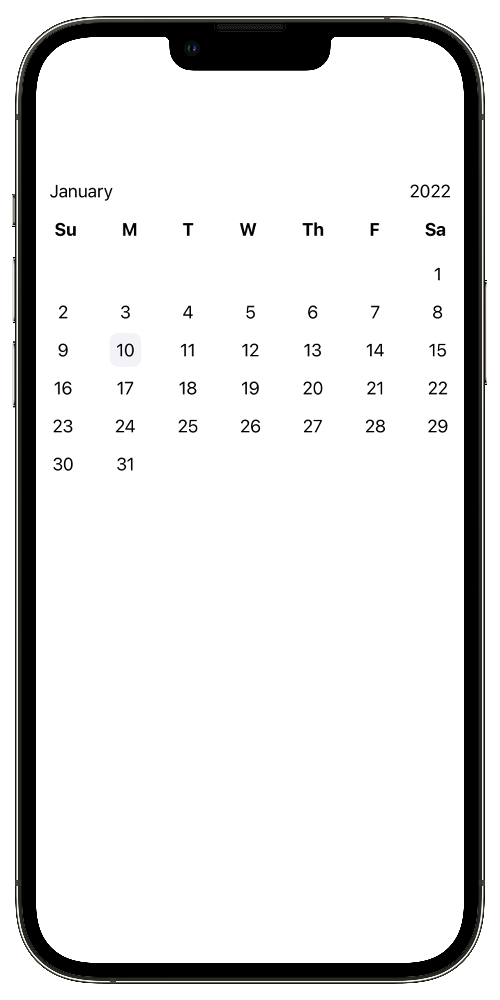

<!--   -->

# CalendarUI


A native SwiftUI calendar component.

 

# Usage
 This package contains a SwiftUI view that will generate the above view. It's very simple to do. 

 Create a `MonthView` and `MonthViewModel`. In the example below we are using the `.mock()` initializer to create a mock view model for the `MonthView`.
 ```
 var body: some View {
   let vm = MonthViewModel.mock()

   MonthView(viewModel: vm) { day in
       print("Day: \(day) selected")
   }
 }
 ```

 The call back method is triggered when a day is tapped in the view. This returns the day as a number.

## MonthViewModel

### Initializer parameters:
  - `model: MonthModel` The model that contains all the month data.
  - `font: Font` Font of the whole view
  - `linePadding: CGFloat` Padding between each week in the month
  - `titleSize: Double` The size of the current month and year
  - `selectedYear: Int` The currently selected year
  - `selectedDay: Int` The currently selected day
  - `showMonthTitle: String` A boolean value that 

## MonthModel

### Initializer parameters:
- `name: String` Name of the month
- `number: Int` Number of the month
- `days: [DayModel]` Array of `DayModel`s for the days of the month